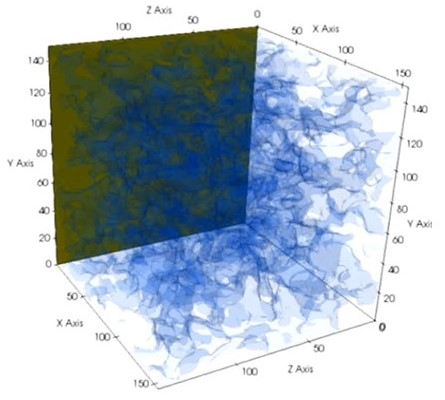
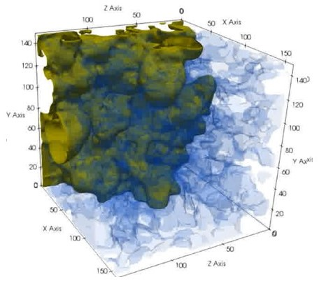
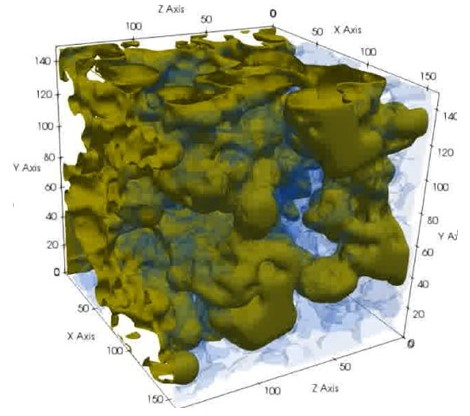
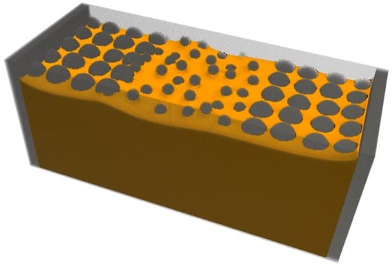
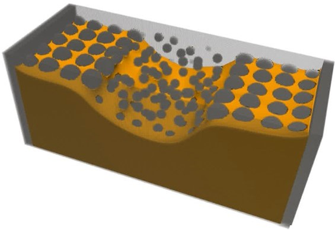
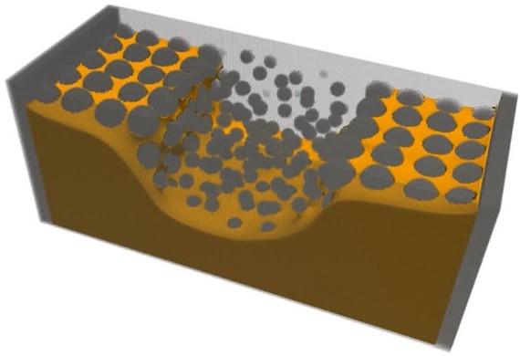

# 🌀 Multiphase Multicomponent Lattice Boltzmann Simulation flowMeld

[](https://en.cppreference.com/w/cpp)
[](https://www.palabos.org/)


Welcome to the Parallel Lattice Boltzmann codebase for simulating **multiphase** and **multicomponent** flows!  
Supports physics such as **imbibition**, **drainage**, and **evaporation** in complex 3D domains.

---

## 📖 Background

This C++ project leverages the [Palabos](https://www.palabos.org/) template library for high-performance parallel physics-based simulations.

---

## 🚀 Quickstart

### 1. Clone the Repository

```bash
mkdir -p ~/flowmeld_workspace
cd ~/flowmeld_workspace
git clone http://scgit.corning.com/haddadigh/flowmeld.git
cd flowmeld
```

### 2. Prerequisites

- **CMake** ≥ v3.10 ([download](https://cmake.org/download/))
- **MPI:** OpenMPI (e.g. `ompi/4.0.0-gcc48`), IntelMPI, MPICH, etc.
- **C++ Compiler:**  
  - GCC/g++ (≥ v8.0)  
  - Intel (icpc)  
  - Clang++
- **Palabos library:** See [installation guide](https://www.palabos.org/installation/)
- *Optional:* Docker

---

### 3. Build Instructions

#### Using GCC + OpenMPI

```bash
mkdir build && cd build
CC=$(which mpicc) CXX=$(which mpic++) cmake ../
make -j$(nproc)
```

#### Using Intel Compilers

```bash
mkdir build && cd build
CC=$(which mpiicc) CXX=$(which mpiicpc) cmake ../
make -j$(nproc)
```
if there is only one processor available in your environment, make performs a sequential build.

#### Manual compiler selection

```bash
mkdir build && cd build
CC=$(which gcc) CXX=$(which g++) cmake -DMPI_C_COMPILER=mpicc -DMPI_CXX_COMPILER=mpic++ ../
make
```

---

### 4. Run the Simulation

Once compiled, you'll have an executable (e.g., `multiphase_sim`):

```bash
mpirun -np 8 ./multiphase_sim multiphase multiphase input.xml
```
- Replace `-np 8` with the number of processors.
- Use your formatted `input.xml` configuration.
- use multiphase for all simulations. Singlephase simulation capabilities are not yet added (open for development)

#### Using Docker (Full Workflow)

**1. Install Docker Desktop**

- [Download Docker Desktop](https://www.docker.com/products/docker-desktop/)
- Follow installation instructions for your OS (Windows, Mac, or Linux).

**2. Create a Dockerfile for Compilation**

Add this `Dockerfile` to your repository root:

```Dockerfile
# Use Ubuntu 22.04 base image
FROM ubuntu:22.04

# Install build essentials, MPI, CMake, and wget
RUN apt-get update && apt-get install -y \
    build-essential \
    cmake \
    libopenmpi-dev \
    openmpi-bin \
    git \
    wget

# Optional: install additional compilers (e.g., clang, Intel oneAPI)
# RUN apt-get install -y clang

# Set the working directory
WORKDIR /work

# Copy source code into container (if building via Docker CLI)
# If using Docker Desktop bind-mount, this is automatic.
# COPY . /work

# Build instructions
# These are *examples*, actual build is via command line (see below)
#
# RUN mkdir build && cd build && \
#     CC=mpicc CXX=mpic++ cmake ../ && \
#     make -j$(nproc)

# Entrypoint is bash (user runs compilation & simulation manually)
CMD [ "/bin/bash" ]
```

**3. Build the Docker Image**

In repo root:

```bash
docker build -t lbm-multiphase .
```

**4. Compile & Run Simulation Inside the Container**

Launch the container and mount your code:

```bash
docker run --rm -it -v $(pwd):/work lbm-multiphase
```

Inside container (shell prompt):

```bash
cd /work
mkdir build && cd build
CC=$(which mpicc) CXX=$(which mpic++) cmake ../
make -j$(nproc)
mpirun -np 8 ./multiphase_sim multiphase input.xml
```

- Replace `-np 8` for number of processes
- Use your own `input.xml` file

**5. Direct Run Shortcut**

Alternatively, you can directly run the simulation (if previously built):

```bash
docker run --rm -v $(pwd):/work lbm-multiphase ./build/multiphase_sim multiphase input.xml
```

**Note:** Bind mount (`-v $(pwd):/work`) keeps your results and source code on your host.

**Tips:**
- For large computations, you can set CPU/memory limits using Docker.
- If you want to change the compiler (e.g., Intel), modify the `Dockerfile` accordingly.

---

## 🖼️ Some sample simulation images


Here is simulation of drainage from a Gaussian random field porous media. In this simulation, a non-wetting invades a porous material initially saturated with a wetting phase. 
:
|  |  |  |
|:-----------------------------------------------:|:-----------------------------------------------:|:-----------------------------------------------:|
| drainage step 1                                 | drainage step 2                                | drainage step 3                                 |

These images show three stages of drying from a porous microstructure with gradient in porosity. Due to the combined effect of easier vapor diffusion and capillary pumping, more liquid is evaporated from the low porosity regions: 
|  |  |  |
|:-----------------------------------------------:|:-----------------------------------------------:|:-----------------------------------------------:|
| drying step 1                                 | drying step 2                                | drying step 3                                 |


## 📝 Input File Instructions

Your simulation uses an XML configuration file. Here are the parameters:

<details>
<summary><strong>📂 Click to expand</strong></summary>

### XML Input Reference

#### `filenames`
- **microstructure:** Path to the microstructure data file (generate this file using the accompanying package or generate your own)
- **output_directory:** Directory (must exist) for simulation results

#### `domain`
- **resolution:** Number of lattice nodes in x, y, z (integer)
- **periodic_bc:** Periodic boundary conditions for each axis (`True` or `False`). If False then symmetry boundary condition is applied. Note than flow direction must always be False.  

#### `flow`
- **type:** Flow setup (`imbibition`, `drainage`, `drying`, or `drying-rate` and `drying-rate` simulates a rate-dependent system)
- **number_of_pressure_steps:** Steps of pressure increment
- **min_throat_radius:** Controls initial capillary pressure

#### `fluids`
- **gc:** Coupling parameter (for drying use `0`; this parameter is the internal cohesion force for each phase)
- **change_type:** How properties change (`range` or `step` for `drying-rate`)
- **g00, g11, g01:** Fluid-fluid interaction strengths (for a two fluid system; important for drying simulations)
- **gmin, gmax:** Range for rate-dependent changes:
- **f1_fluid_surface_adhesion:** Wetting coefficient (can change from -0.4 to 0.4, for wetting and non-wetting systems)
- **omega***:** Fluid relaxation times (set/change viscosity, chooise a number from 0.53 to 1)
- **density***:** Densities for each phase and region (2 is a safe number)
- **force***:** External force and direction

#### `simulations`
- **max_iterations:** Maximum allowed iterations
- **max_pressure_iterations:** Iterations per pressure step
- **output_frequency:** Output save period
- **converge_check_frequency:** Interval for convergence checking
- **converge_criterion:** Numerical threshold for convergence

</details>

---


## 📜 License

Copyright 2025. Corning Incorporated. All rights reserved.


This software may only be used in accordance with the identified license(s).

THE SOFTWARE IS PROVIDED "AS IS", WITHOUT WARRANTY OF ANY KIND, EXPRESS OR
IMPLIED, INCLUDING BUT NOT LIMITED TO THE WARRANTIES OF MERCHANTABILITY,
FITNESS FOR A PARTICULAR PURPOSE AND NONINFRINGEMENT. IN NO EVENT SHALL
CORNING BE LIABLE FOR ANY CLAIM, DAMAGES OR OTHER LIABILITY, WHETHER IN AN
ACTION OF CONTRACT, TORT OR OTHERWISE, ARISING FROM, OUT OF OR IN
CONNECTION WITH THE SOFTWARE OR THE USE OF THE SOFTWARE.


---

## 📚 References

- [Palabos Documentation](https://www.palabos.org/documentation/)
- H. Huang, "Simulation of multiphase flows with lattice Boltzmann method," *Phys. Rev. E*, 2007.

---

## 👨‍💼 Authors & Contact

- **Dr. Hamed Haddadi** (Staff Scientist)  
  haddadigh@corning.com  
- **Dr. David Heine** (Principal Scientist and Manager)  
  heinedr@corning.com  

---

## 💻 Contributing

Pull requests and issues welcome!  
Star ⭐ the repo if you found it useful.

---

## 🏁 Happy Simulating!


